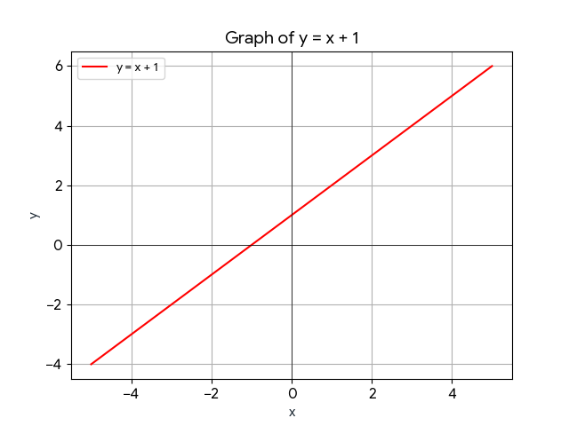
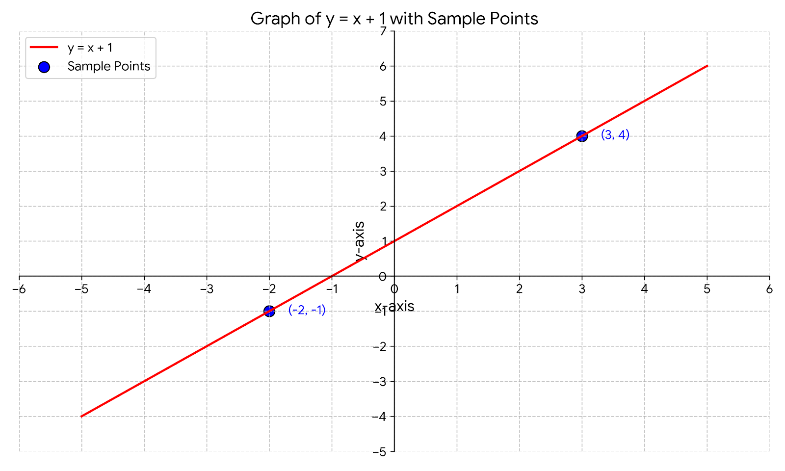
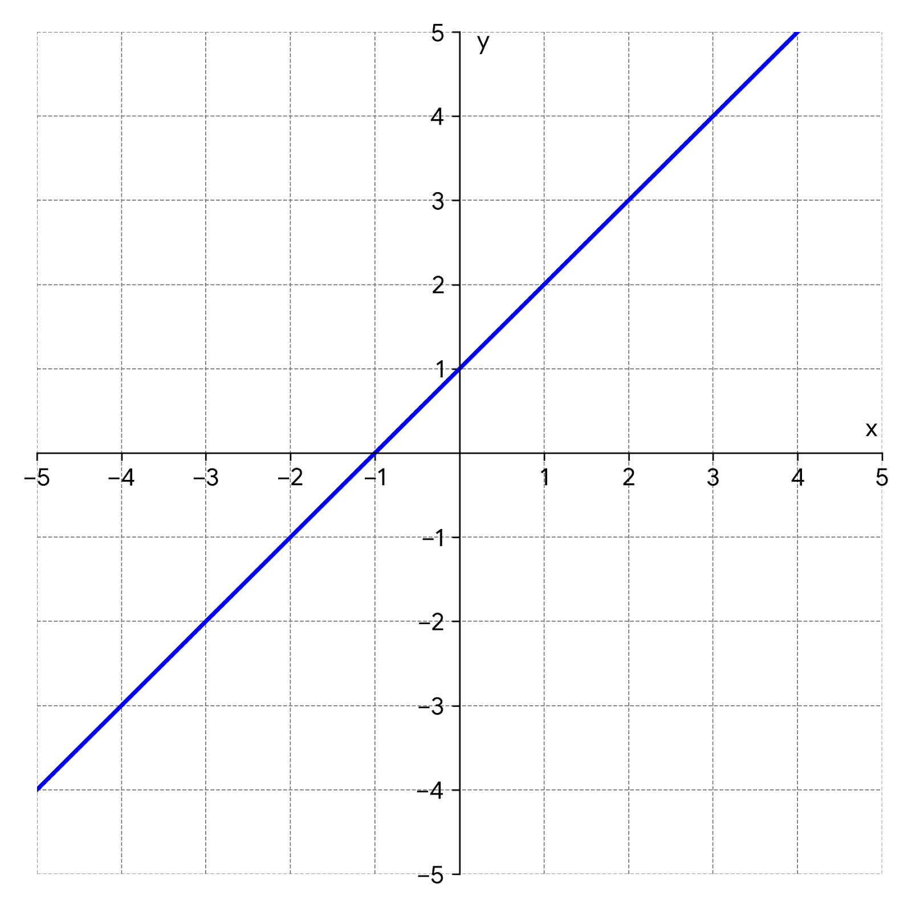
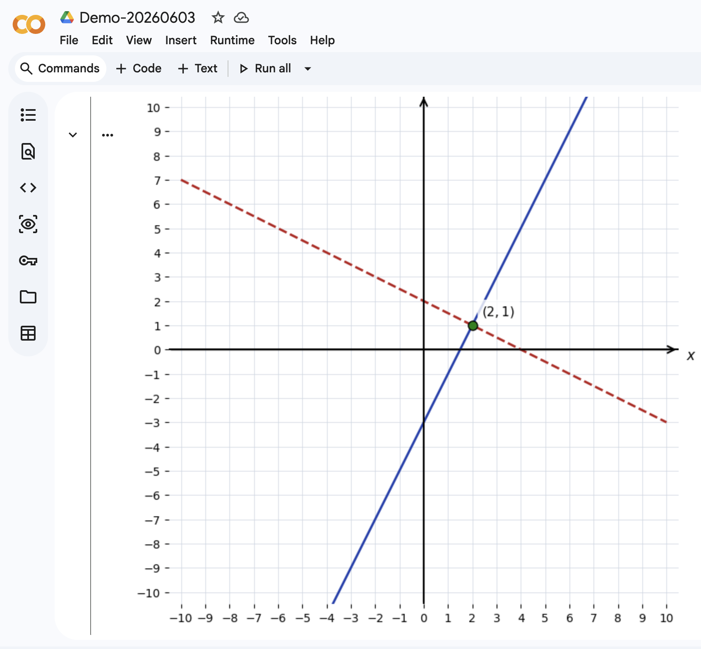
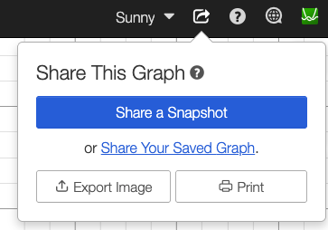
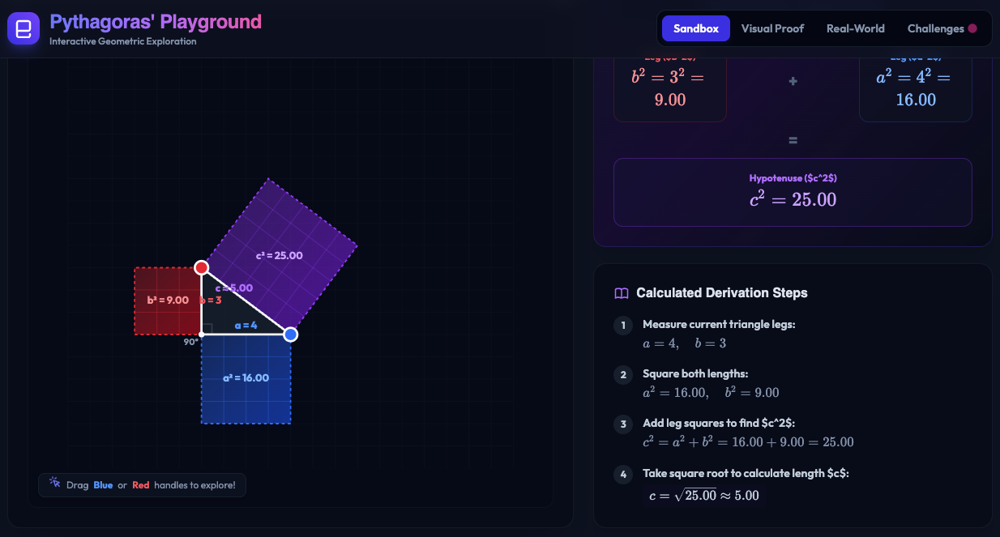

# Welcome to AI in Assessment

AI Powered Assessment Automation
This repository contains code and resources for automating assessment processes using artificial intelligence. The goal is to streamline and enhance the efficiency of assessments in secondary mathematics.

# Hello! My name is Sunny 🌞


[Sunny Ng](https://training.imagenation.com.hk/#sunny-ng)  
**Founder / Master Trainer** at [Image Nation](https://training.imagenation.com.hk)  
**Part-time Lecturer** at HKU Business School, HKU School of Chinese, HKUSPACE, EdUHK  
**Email**: sunny.ng@imagenation.com.hk

# Useful Keyboard Shortcuts

| Keyboard Shortcut | Description                                         |
| ----------------- | --------------------------------------------------- |
| `SHIFT` + `ENTER` | Move cursor to next line without sending out prompt |
| `CTRL` + Click    | Open a link in a NEW browser tab                    |
| `ALT` + `=`       | Insert / Edit LaTex                                 |
| `CTRL` + `Z`      | Undo last action                                    |
| `CTRL` + `C`      | Copy selected text                                  |
| `CTRL` + `V`      | Paste copied text                                   |
| `WIN` + `D`       | Show Windows Desktop                                |
| `CTRL` + `F`      | Search on the current page                          |

# Popular GenAI Tools

It is more effective to keep multiple tabs open for different tools.

To open the following AI tools in a **NEW** browser tab, hold `CTRL` (or `CMD` on Mac) when clicking the links below.

- [Gemini](https://gemini.google.com) - Google Gemini is a powerful, multimodal large language model developed by Google that can understand and process a wide range of information, including text, images, canvas (apps),audio, and video.
- [Perplexity](https://www.perplexity.ai) - AI search engine that provides concise answers with sources.
- [Microsoft Copilot](https://copilot.microsoft.com/) - Free Microsoft AI assisant.
- [Grok](https://grok.com) - AI tool for generating text and code.
- [Poe](https://poe.com) - Platform to access multiple AI models in one place.
- [Qwen](https://chat.qwen.ai) - Conversational AI for various tasks
- [Doubao](https://www.doubao.com) - Conversational AI for various tasks
- [DeepSeek](https://www.deepseek.com) - Conversational AI for various tasks (**NOT** a multi-modal tool)
- [VisualGPT](https://visualgpt.io) - Photo Editor with AI / Image Generation
- [LMArena](https://lmarena.ai) - Compare and explore different large language models.
- [Notion AI](https://www.notion.com) - Note-taking and productivity app with AI features.
- [Canva](https://www.canva.com) - Graphic design platform with AI-powered tools. Great for PowerPoint Generation.
- [Google Classroom](https://classroom.google.com) - AI-powered learning management system for educators and students.

# More on Popular AI Tools

- [Microsoft 365 Copilot](https://m365.cloud.microsoft/) - AI assistant integrated into Microsoft 365 apps.
- [ElevenLabs](https://elevenlabs.io) - AI-powered text-to-speech platform.
- [narakeet](https://www.narakeet.com/languages/chinese-text-to-speech/) - Easily Create Voiceovers Using Realistic Text to Speech
- [Cleanvoice AI](https://cleanvoice.ai) - Audio editing tool that removes filler words, stutters, and long pauses from audio recordings.
- [Stable Diffusion](https://stablediffusionweb.com) - Open-source image generation model.
- [Kling AI](https://app.klingai.com) - AI-powered video creation platform.
- [Hailuo AI](https://hailuoai.video) - AI-powered video creation platform.
- [Runway](https://runwayml.com) - AI-powered video editing and creation
- [newarc](https://www.newarc.ai/) - AI-powered fashion creative platform.
- [Tripoai](https://studio.tripo3d.ai) - AI-powered 3D content creation platform.
- [ideogram](https://ideogram.ai/) - AI-powered image generation platform.
- [ Napkin AI](https://www.napkin.ai/) - The visual AI for business storytelling.

# Other Tech Tools for Teaching & Learning

- [Google Sites](https://sites.google.com/) - Free website builder by Google, great for creating a class website or portfolio.
- [DILLINGER](https://dillinger.io/) - Online Markdown playground/editor.
- [Pandoc](https://pandoc.org/index.html) - Universal document converter that can convert between various formats, including Markdown, HTML, PDF, and more.

# Graphs and Charts Tools

- [desmos](https://www.desmos.com/) - Graphing calculator with AI features for mathematics education.
- [GeoGebra](https://www.geogebra.org/) - Dynamic mathematics software for geometry, algebra, and calculus education.

# Other Resources

- [Basic Compentency Descriptor for KS3 Mathematics](./docs/KS3%20Math%20BC_Nov_2020_%20EN.pdf) - Education Bureau's curriculum documents for secondary mathematics education in Hong Kong.
- [EDB Assessment for Learning](https://www.edb.gov.hk/en/curriculum-development/assessment/about-assessment/assessment-for-learning.html) - Education Bureau's resources on assessment for learning in Hong Kong.
- [EDB Curriculum Docs](https://www.edb.gov.hk/en/curriculum-development/kla/ma/curr/index2.html) - Curriculum documents for secondary mathematics education in Hong Kong.
- [Math EXE](https://math-exe.com/) - Math exercise FREE PDF download website.
- [Markdown & LaTex Quick Start](https://ashki23.github.io/markdown-latex.html)

# Mastering RICE FACT Effective Prompting

RICE FACT is a useful framework to help you structure your prompts effectively when using AI tools. It stands for Role, Instruction, Context, Example, Format, Action, Constraint, and Tone. By incorporating these components into your prompts, you can guide the AI to generate more accurate and relevant responses.

There are other prompting frameworks such as **ICIO** (Instruction, Context, Input, Output), **SCQA** (Situation, Complication, Question, Answer) and **STAR** (Situation, Task, Action, Result), they all have their own advantages and disadvantages. RICE FACT is more comprehensive and flexible, allowing you to include various elements in your prompts to achieve better results.

**Beginner Pitfall**: AI beiginner users tend to use simple Instruction-only prompts, which often lead to vague and irrelevant responses. By adding more prompt components such as Role, Context, Example, Format, Action, Constraint, and Tone, you can significantly improve the quality of the AI's responses.


**Tips 1**: You can just click the copy button to replicate the prompt in your AI ssistant. It's OKAY to include the RICE FACT tags in your prompt.  
**Tips 2**: In your furture prompting, You DON'T actually have to specifically add these tags in your prompts. They are just there to help you better understand the prompt structure.  
**Tips 3**: It's NOT common to include all RICE FACT components in a single prompt.

**Instrustion** only

```
Role        →
Instruction → Explain what GenAI is.
Context     →
Example     →
Format      →
Action      →
Constraint  →
Tone        →
```

---

**Instruction** + **Format**

```
Role        →
Instruction → Explain what GenAI is.
Context     →
Example     →
Format      → Use one sentence.
Action      →
Constraint  →
Constraint  →
```

---

**Role** + **Instruction** + **Format**

```

Role        → You are a secondary teacher.
Instruction → Explain what GenAI is.
Context     →
Example     →
Format      → Use one sentence.
Action      →
Constraint  →
Tone        →

```

---

**Role** + **Instruction** + **Format**

```

Role        → You are a kindergarten teacher.
Instruction → Explain what GenAI is.
Context     →
Example     →
Format      → Use one sentence.
Action      →
Constraint  →
Tone        →

```

---

**Role** + **Instruction** + **Context**

```

Role        → You are a secondary teacher.
Instruction → Explain what GenAI is.
Context     → The target audience are non-ICT students.
Example     →
Format      →
Action      →
Constraint  →
Tone        →

```

---

**Instruction** + **Format**

```
Role        →
Instruction → Explain what GenAI is.
Context     →
Example     →
Format      → Use three bullet points.
Action      →
Constraint  →
Tone        →
```

---

**Instruction** + **Format** + **Constraint**

```
Role        →
Instruction → Explain what GenAI is.
Context     →
Example     →
Format      → Use three bullet points.
Action      →
Constraint  → Each bullet points not more than 15 words.
Tone        →
```

---

**Instruction** + **Example**

```
Role        →
Instruction → Generate 10 dummy customer records as below
Context     →
Example     → CustID, CustName, Email, Mobile, Address
Format      →
Action      →
Constraint  →
Tone        →
```

---

# Assessments Design with RICE FACT


**Instruction** only  
Prompt Quality: ZERO star

```
Role        →
Instruction → Make a quiz
Context     →
Example     →
Format      →
Action      →
Constraint  →
Tone        →
```

---

**Instruction** only  
Prompt Quality: \*

```
Role        →
Instruction → Make a quiz about factorization
Context     →
Example     →
Format      →
Action      →
Constraint  →
Tone        →
```

---

**Instruction** + **Format**  
Prompt Quality: \*\*

```
Role        →
Instruction → Make a quiz about factorization
Context     →
Example     →
Format      → Make outputs in plain texts.
Action      →
Constraint  →
Tone        →
```

---

**Instruction** + **Context** + **Format**  
Prompt Quality: \*\*\*

```
Role        →
Instruction → Make a quiz about factorization
Context     → The targets are secondary three students.
Example     →
Format      → Make outputs in plain texts.
Action      →
Constraint  →
Tone        →
```

---

**Instruction** + **Context** + **Format** + **Action**  
Prompt Quality: \*\*\*\*

```
Role        →
Instruction → Make a quiz about factorization
Context     → The targets are secondary three students.
Example     →
Format      → Make outputs in plain texts.
Action      → Produce 5 M.C. and 3 short questions.
Constraint  →
Tone        →
```

---

**Instruction** + **Context** + **Format** + **Action**  
Prompt Quality: \*\*\*\*\*

```
Role        → You are a HK secondary math tutor.
Instruction → Make a quiz about factorization
Context     → The targets are secondary three students.
Example     →
Format      → Make outputs in plain texts.
Action      → Produce 5 M.C. and 3 short questions.
Constraint  →
Tone        →
```

---

**Instruction** + **Context**  
Prompt Quality: \*\*\*\*\*

Referring to EDB Docs **KS3-NA01-1** learning objective, design a quiz about factorization for secondary three students.

[Download EDB KS3 Competency Descriptors](/docs/KS3%20Math%20BC_Nov_2020_%20EN.pdf)

```
Role        →
Instruction → Produce 5 M.C.
Context     → based on HKEDB KS3-NA01-1 learning objective.
Example     →
Format      →
Action      →
Constraint  →
Tone        →
```

---

**Instruction** + **Context**  
Prompt Quality: \*\*\*\*\*

Referring to EDB Docs **KS3-NA08-1** learning objective

[Download EDB KS3 Competency Descriptors](/docs/KS3%20Math%20BC_Nov_2020_%20EN.pdf)

```
Role        →
Instruction → Produce 5 M.C.
Context     → based on HKEDB KS3-NA08-1 learning objective.
Example     →
Format      →
Action      →
Constraint  →
Tone        →
```

---

**Instruction** + **Context**  
Prompt Quality: \*\*\*\*\*

```
Role        →
Instruction → Produce 5 M.C.
Context     → based on HKEDB KS3-MSS22 and KS3-MSS23
Example     →
Format      →
Action      →
Constraint  →
Tone        →
```

---

**Instruction** + **Context**  
Prompt Quality: \*\*\*\*\*

```
Role        →
Instruction → Produce 5 M.C.
Context     → based on HKEDB KS3-MSS22 and KS3-MSS23
Example     →
Format      →
Action      → Make it in Traditional Chinese.
Constraint  →
Tone        →
```

---

**Prompt with uploaded samples assessment**

- Download a sample exercise paper. Hold CTRL key and click the link -> [Math EXE](https://math-exe.com/s3).
- Pick one of the exercise papers that you like.
- Start a **NEW** conversation with your AI assistant.
- Upload the sample exercise paper to your AI assistant and prompt it to

```
Generate a similar exercise paper based on the uploaded sample.  Targets Hong Kong secondary three students.
```

---

**Prompt it to generate a Word format document**


```
Create a Word format document that I can donwload and make further edits.
```

---

**Prompt to generate a PDF format document**  


```
Create a PDF format document that I can download and print directly.
```

# AI Generated Graphs / Charts / Diagrams


AI generated graphs are not always perfect, but they can be a good starting point for creating visual representations of mathematical concepts. You can use AI tools to generate graphs based on specific prompts, and then edit or refine them as needed.

---

```
generate a diagram to represent y = x + 1
```



**Note**: AI is not always right. The graph is NOT perfect. The x-axis and y-axis are not in the same scale.

---

```
generate a diagram to represent y = x + 1
add two sample points on the graph
```



---

```
Generate a diagram to represent y = x + 1
I am using the graph in test paper and therefore hide details that give hints to answer.
```



# Get Inspirations from AI

Use the following prompts to gain some ideas on how to prompts AI assistant for graphing and charting in mathematics education.

---

```
Show me some sample prompts to generate graph or charts or diagram for mathematics assessment such as assignments, test paper and exam.  Target audience are secondary three students in Hong Kong. The graph or charts or diagram should be related to the learning objectives in EDB KS3 curriculum.
```

---

```
Show me 10 example prompts that instruct AI to generate python codes that run on Google colab to generate various graphs and charts for the purpose of secondary school mathematics assessment design.
```

---

# Generate Graphs with Google Colab

A sample prompt to generate Python codes that can run on Google Colab to create graphs and charts for mathematics assessments.

---

```
Write Python code for Google Colab to plot a coordinate grid spanning from -10 to 10 on both the x and y axes. Graph the linear equations y = 2x - 3 and y = -0.5x + 2. Make sure the x and y axes intersect at (0,0) with bold black lines and arrows, standard 1-unit step grid lines are visible, and the intersection point is clearly marked with a coordinate point label for a simultaneous equations problem.
```



Besides colab, you can also use Juyputer Playground to quick-test run your python codes.

Click here to → [Try Jupyter](https://jupyter.org/try)

---

# Generate Graphs with Desmos


Desmos is a powerful graphing calculator that can be used to create graphs for mathematics assessments. You can use Desmos to generate graphs for various mathematical functions and equations, and then export them as images to include in your test papers or assignments.

`CTRL`+Click to open Desmos in a new browser tab → [Desmos Graphing Calculator](https://www.desmos.com/calculator).

---

**Creating Your Graph**  
Pasting the **LaTex** codes to Desmos item cells.


---

**Exporting Your Graph**  
After creating your graph, you can click on the "Share" button and select **Export Image** to download the graph as a PNG file. You can then insert this image into your test paper or assignment document.  


---

# AI Generated Interactive Contents

Gemini Canvas is a powerful tool that allows you to create interactive content for your assessments. You can use it to create interactive quizzes, diagrams, and other visual aids that can enhance the learning experience for your students.



Here is an pre generated canvas interactive learning tool for student to explore Pytagorean theorem → [Pythaorean Playground](https://gemini.google.com/share/c6d61e7bb523)

It's pre-generated with the following prompt:

```
Greate a playground for student to explore Pythagorean theorem
```

# Auto Making / Grading

AI can also be used to automate the process of creating and grading assessments. You can use AI tools to generate questions, create answer keys, and even grade student responses. This can save you a lot of time and effort, allowing you to focus more on teaching and less on administrative tasks.

**Create Interactive Quiz**

This is is doable in **Gemini** and **Copilot** and a few other AI tools. You can create interactive quizzes where students can input their answers and receive immediate feedback. This can be a great way to engage students and provide them with instant feedback on their understanding of the material.


**Creating Sample Gemini Quiz**  
In Gemini, start a new chat and put in the following prompts.

```
Create a quiz for Hong Kong Secondary three students. Make 5 mathematics M.C. based on KS3-MSS22 and KS3-MSS23 learning objectives.
```

```
Create a quiz for Hong Kong Secondary three students. Make 5 mathematics M.C., 3 true/false questions  based on KS3-MSS22 and KS3-MSS23 learning objectives.
```

```
Create a quiz for Hong Kong Secondary three students. Make 5 mathematics M.C., 3 true/false questions and three short questions based on KS3-MSS22 and KS3-MSS23 learning objectives.
```

# Using Gemini in Google Classroom


You can also use Google Classroom to create quizzes and export as Google Forms Quiz.


---

**Creating Google Form Quiz in Google Classroom**

1. Go to → [Google Classroom](https://classroom.google.com)
1. In Google Classroom, choose **Gemini** page
1. Choose **Generate a quiz** from the tools menu
1. Input `9` for **Target grade** and `10` for **number of questions**
1. Put in prompts `Create a quiz for Hong Kong Secondary three students based on KS3-MSS22 and KS3-MSS23 learning objectives.`
1. Choose **ALL** question types
1. Choose **Generate questions**
1. Click **Export** button and choose **Export to Forms**
1. Choose **View Google Form** to edit/manage the quiz in Google Forms

---

**Google Forms Quiz Grading & Response Analysis**
In google forms, you can view the responses and do some basic analysis. You can also export the responses to Google Sheets for further analysis.
